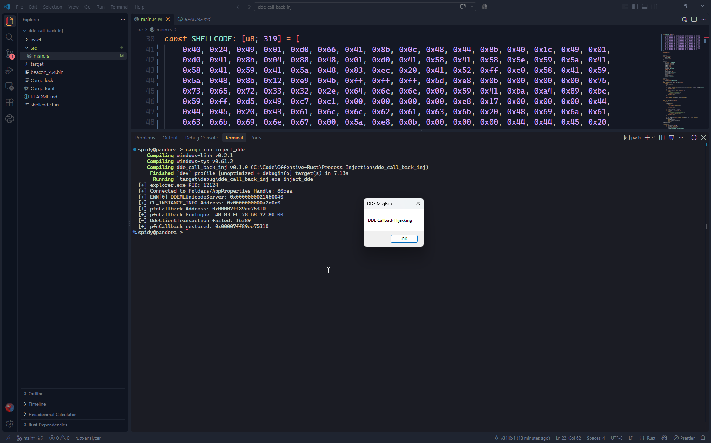

## MessageBox POC

## Cobalt Strike Beacon

> Note: When the beacon runs, execution control transfers to the beacon and never returns to explorer.exe. Since the beacon does not return to the DDEML callback, when the beacon exits, the explorer.exe process crashes. This may cause issues on the desktop since the Windows UI is managed by explorer.exe. To recover, spawn a new explorer.exe instance.
